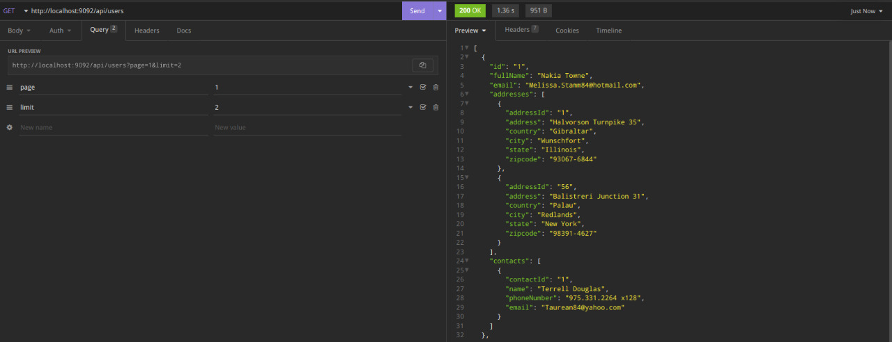

## Desafiotech-junior

Esse projeto visa integrar com uma API externa, essa API nos fornece uma collection de usuários, e também informações sobre endereço do mesmo e lista de contatos. Então fazemos o processamento e salvamos o usuário com seus respectivos endereços e contatos.

## Indice

- [Desafiotech-junior](#Desafiotech-junior)
- [Índice](#indice)
- [Características](#características)
- [Setup](#setup)
  - [Pré-requisitos](#pre-requisitos)
  - [Instruções](#instruções)
- [Start](#start)
- [Tecnologias](#tecnologias)
- [Ambiente](#ambiente)

## Características

- Integrando o sistema Mockapi, recebendo todos os usuários.
- Integrando com mockapi, recebendo endereços de cada usuário.
- Integrando com mockapi, recebendo contatos de cada usuário.
- Processando os usuários, com seus endereços, e persistindo no MONGODB.

## Setup

### Pré-requisitos

- [Node 14.17.5 LTS](https://nodejs.org/en/) -> Para rodar a aplicação
- [NPM](https://www.npmjs.com) -> Para instalar e usar os scripts package.json
- [MongoDB](https://www.mongodb.com/try) -> Para configurar localmente ou usar o cluster MongoDB Atlas
- [Mockapi](https://www.mockapi.io) -> Para integração com o mockapi, crie uma conta e pegue a chave da API

### Instruções

Feito os pré-requisitos, o próximo passo é seguir estas instruções:

1. Clonar o repositório.
2. Abra o terminal na pasta raiz do projeto e digite "npm install" para instalar todas as dependências.
3. Crie um arquivo chamado ".env" na raiz do projeto.
4. Use o seguinte código no arquivo criado:

# LOCAL

```env
MONGODB_URI='mongodb+srv://<YOUR_HOST>'
MOCK_API_HOST=<YOUR_MOCKAPI_KEY>
API_PORT=4000
VERSION=1.0.0
```

Para cada variável de ambiente você precisa substituir por seus **próprios dados configurados**.

5. Com a configuração concluída, você só precisa testar a execução do **npm run start:dev**
6. Se tudo estiver OK, você deve testar o status do servidor através do endpoint: **seu_dominio:sua_porta/api/health** que retorna um JSON com informações básicas como: `{ "status": "ok", "info": { "mongoose": { "status": "up" } }, "error": {}, "details": { "mongoose": { "status": "up" } }, "version": "1.0.0" }`.
7. Divirta-se! :D

## Start

Feito as instruções, agora é a hora de usar o nosso sistema:

1. api/health:
   
2. api/users:
   
3. A rota **api/users** suporta parâmetros de paginação, que podem ser utilizados através da queryString para realizar a listagem completa de dados.
4. Para melhor funcionamento do sistema recomendamos que busquem apenas 10 usuários por vez.

## Tecnologias

- :star: Node.js
- :star: Nestjs
- :star: Moongose
- :star: MongoDB Atlas
- :star: Mockapi

## Ambiente

- :desktop_computer: Visual Studio Code para codificação
- :desktop_computer: MongoDB Compass para gerenciamento de banco de dados
- :desktop_computer: Insomnia para testes de API
- :desktop_computer: Git para versionamento de código
- :desktop_computer: Spotify para focar
- :desktop_computer: Stack Overflow para debug
